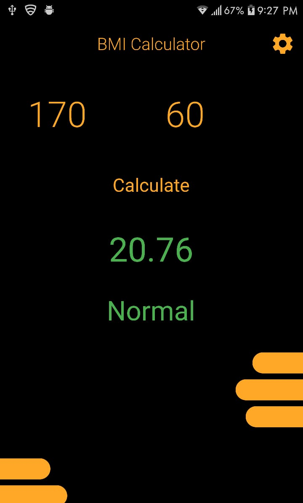
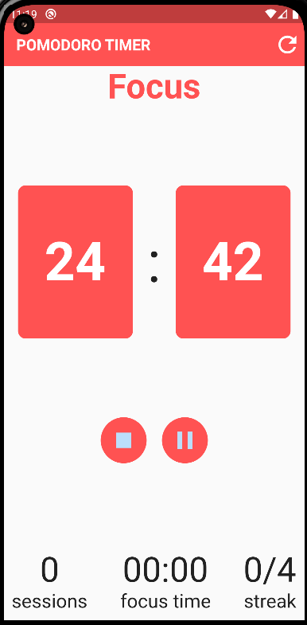
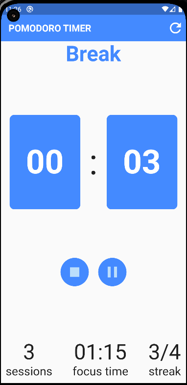
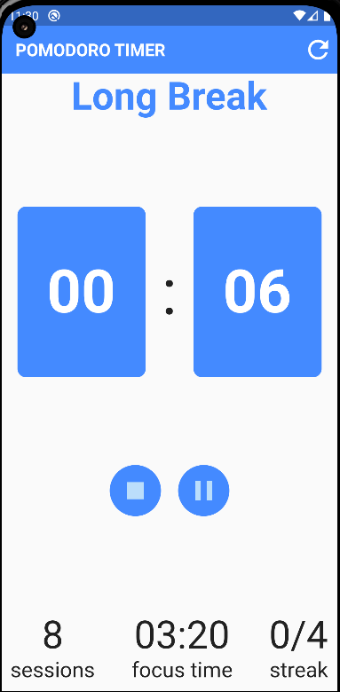
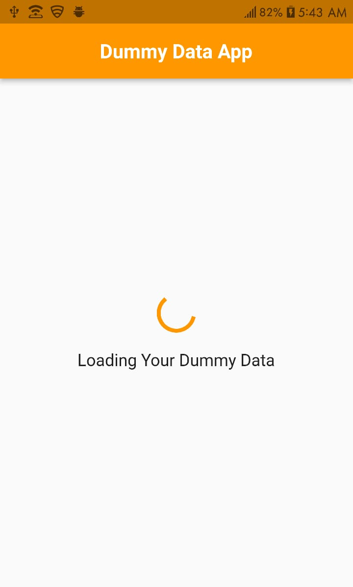
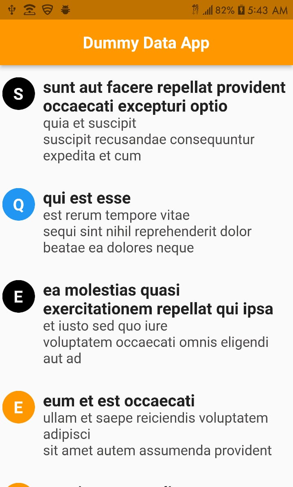

# Simple apps to practice Flutter

## - [BMI Calculator:](https://github.com/Abdelrahman-tlayjeh/basic-flutter-apps/tree/main/bmi_calculator)
### an app that calculates the BMI & the IBW

     
     
     

## - [Pomodoro Timer:](https://github.com/Abdelrahman-tlayjeh/basic-flutter-apps/tree/main/pomodoro_timer)
### a simple pomodoro timer

     
     
     

## - [Useless App:](https://github.com/Abdelrahman-tlayjeh/basic-flutter-apps/tree/main/useless_app)
### an app that just fetches a fake API

     
     

## - [To Do App:](https://github.com/Abdelrahman-tlayjeh/basic-flutter-apps/tree/main/todo_app)
### a simple, fully functional to-do app

     
    
     

