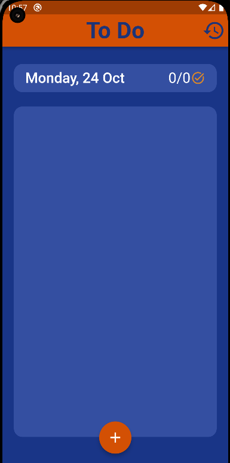
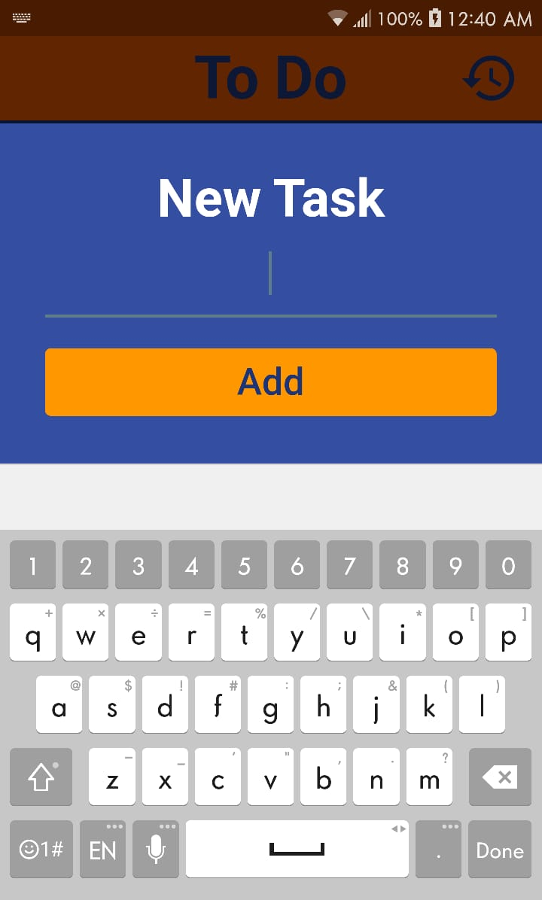
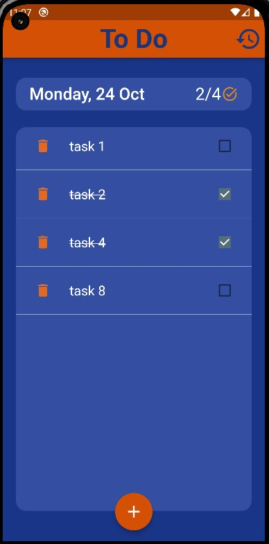
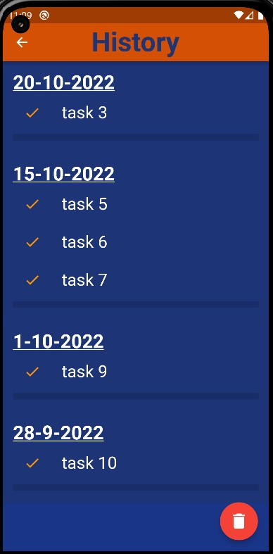

# \#4 Flutter project | To-Do App

<h2>A fully functional to-do app that uses 'Hive' for local data storage and 'Provider' for state management.</h2>
 

## Screenshots:

     
     
     
     
     

